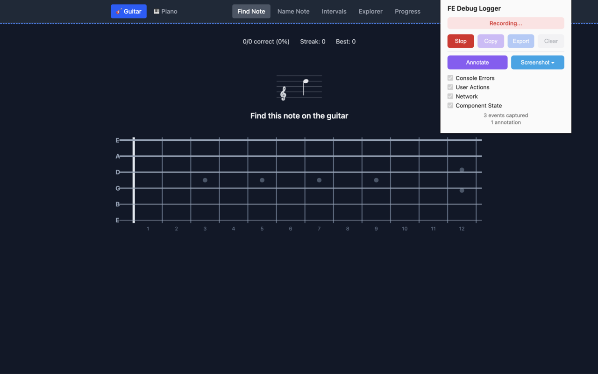
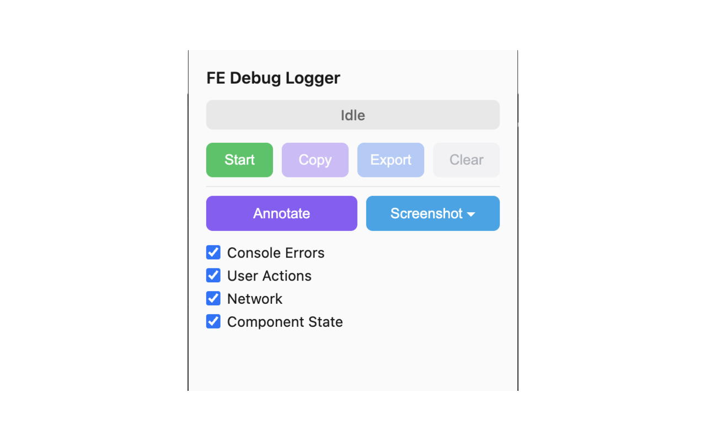
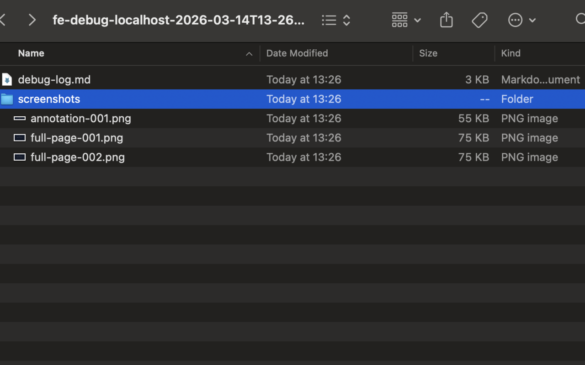

# FE Debug Logger

Chrome extension that captures frontend debug logs as structured Markdown — optimized for AI-assisted debugging with Claude Code.

| Recording & Annotation | Popup UI | Exported Output |
|---|---|---|
|  |  |  |

## Features

- **Console Capture** — hooks `console.error`, `console.warn`, `window.onerror`, unhandled promise rejections
- **User Action Tracking** — records clicks, form inputs, navigation with DOM selectors
- **Network Monitoring** — logs HTTP errors (status >= 400) and slow requests (> 3s)
- **Component State Snapshots** — auto-detects React & Vue, captures props/state trees
- **DOM Annotation** — click elements to annotate with notes (`Cmd+Shift+A` / `Ctrl+Shift+A`)
- **Screenshot Capture** — full page or select region
- **Selective Capture** — toggle categories independently
- **Sensitive Data Masking** — auto-masks password/token/apiKey fields
- **Structured Markdown Export** — session metadata, formatted tables, code blocks
- **MCP Integration** — let Claude Code control recording programmatically

## Install

### 1. Install Chrome Extension

**From Chrome Web Store** (coming soon)

**Manual Install (Developer Mode):**

1. Clone this repository:
   ```bash
   git clone https://github.com/minhtn012/fe-debug-logger.git
   ```
2. Open `chrome://extensions/` in Chrome
3. Enable **Developer mode** (top right)
4. Click **Load unpacked** and select the cloned folder
5. Pin the extension from the toolbar

### 2. Install MCP Server (Optional)

The MCP server lets Claude Code control the extension programmatically. Skip this if you only need manual usage.

```
Claude Code ←→ MCP Server (stdio) ←→ WebSocket (localhost:3456) ←→ Chrome Extension
```

**Step 1:** Install dependencies:
```bash
cd mcp-server
npm install
```

**Step 2:** Add to Claude Code MCP config (`~/.claude/settings.json`):
```json
{
  "mcpServers": {
    "fe-debug": {
      "command": "node",
      "args": ["/absolute/path/to/fe-debug-logger/mcp-server/index.js"]
    }
  }
}
```

**Step 3:** Restart Claude Code. The extension auto-connects to the MCP server when you open any page in Chrome.

**Environment Variables:**

| Variable | Default | Description |
|----------|---------|-------------|
| `FE_DEBUG_PATH` | `~/Downloads/fe-debug/sessions/` | Directory for saved debug sessions |

---

## Usage: Manual Mode

Use the extension popup to capture debug data manually.

### Basic Workflow

1. Navigate to the page you want to debug
2. Click the extension icon to open the popup
3. Toggle capture categories as needed:
   - **Console Errors** — `console.error`, `console.warn`, unhandled exceptions
   - **User Actions** — clicks, form inputs, navigation, keyboard events
   - **Network** — HTTP errors (4xx/5xx), slow requests (> 3s)
   - **Component State** — React/Vue component props & state trees
4. Click **Start** to begin recording
5. Reproduce the issue on the page
6. Click **Stop** when done
7. Choose an output method:
   - **Copy** — copies Markdown to clipboard (paste directly into Claude Code)
   - **Export** — downloads as `.md` file or `.zip` (if screenshots included)
8. **Clear** — resets all captured data for a new session

### Annotation Mode

Annotate specific UI elements with notes to highlight problem areas:

1. Click **Annotate** in the popup (or press `Cmd+Shift+A` / `Ctrl+Shift+A`)
2. Hover over elements — they'll be highlighted with a blue outline
3. Click an element to select it
4. Enter a note describing the issue (e.g., "This button doesn't respond on mobile")
5. The annotation captures: element tag, CSS selector, dimensions, and your note
6. Press `Esc` or click **Annotate** again to exit annotation mode
7. Annotations appear in the exported Markdown with element context

### Screenshot Capture

Capture visual evidence alongside your debug logs:

1. Click the **Screenshot** dropdown in the popup
2. Choose a capture mode:
   - **Full Page** — scrolls and stitches the entire page into one image
   - **Select Region** — drag a rectangle to capture a specific area
3. Screenshots are embedded as base64 images in the export
4. Maximum 5 screenshots per session to keep export size manageable

### Feed to Claude Code

After exporting, pass the debug log to Claude Code:

```bash
# Option 1: Reference the exported file
claude "Analyze this debug log and fix the bug: $(cat fe-debug-log-20260314-153022.md)"

# Option 2: Copy from extension, then paste directly into Claude Code
```

The exported Markdown gives Claude Code full context: what the user did, what errors occurred, what network requests failed, and what the component state looked like — no manual copy-pasting from DevTools needed.

---

## Usage: MCP Mode

> **Prerequisite:** Complete [Install MCP Server](#2-install-mcp-server-optional) first.

With MCP mode, Claude Code controls the extension directly — no manual clicking needed.

### Available Tools

| Tool | Description |
|------|-------------|
| `get-status` | Check extension connection and recording status |
| `start-recording` | Start capturing (configurable: console, userActions, network, componentState) |
| `stop-recording` | Stop recording and return all captured entries + screenshots |
| `get-debug-log` | Read latest debug log (live from extension or saved .zip files) |
| `list-debug-logs` | List saved debug sessions from `~/Downloads/fe-debug/sessions/` |
| `cleanup-debug-logs` | Delete sessions older than N days (default: 7) |

### Workflow Examples

**Example 1: Live capture**
```
You: "I'm seeing a bug on the checkout page. Start recording."
Claude: Uses `start-recording` → extension begins capturing on your active tab

You: "OK I just reproduced it. What happened?"
Claude: Uses `stop-recording` → receives all entries (console errors, network failures,
        user actions, component state) + screenshots
Claude: Analyzes the data and suggests a fix
```

**Example 2: Read saved session**
```
You: "Check my latest debug log"
Claude: Uses `list-debug-logs` → finds saved .zip sessions
Claude: Uses `get-debug-log` → reads markdown + screenshots from the latest session
Claude: Provides analysis
```

**Example 3: Targeted capture**
```
You: "Record only network errors and console logs, skip user actions"
Claude: Uses `start-recording` with config:
        { console: true, network: true, userActions: false, componentState: false }
```

### Troubleshooting MCP Connection

| Issue | Solution |
|-------|----------|
| "Extension not connected" | Open any webpage in Chrome with the extension installed |
| MCP server not showing in Claude Code | Check `~/.claude/settings.json` path is absolute and correct |
| WebSocket won't connect | Make sure port 3456 is not in use: `lsof -i :3456` |
| Extension disconnects frequently | Normal — it auto-reconnects up to 3 times with 5s intervals |

---

## Export Format

The exported Markdown includes:

| Section | Content |
|---------|---------|
| Session Info | URL, timestamp, duration, browser, viewport |
| Console Errors | Error messages with stack traces |
| User Actions | Click/input/navigation log with selectors |
| Network Issues | Failed requests, slow responses |
| Component State | React/Vue component tree snapshots |
| Annotations | Element annotations with notes |
| Screenshots | Captured images (base64) |

## Architecture

- **Manifest V3** — Chrome 88+
- **Vanilla JavaScript** — zero external dependencies (except bundled jszip)
- **Dual Content Script Pattern**:
  - ISOLATED world: Chrome API access, message bridge
  - MAIN world: Console/fetch/XHR hooks, framework detection
- **Offscreen Document** — Blob creation for MV3 file downloads
- **Chrome Storage API** — session state survives service worker restarts

## Privacy

- All data is stored **locally** on your machine (Chrome Storage API)
- **No analytics**, no tracking, no external data transmission
- Sensitive fields (password, token, secret, apiKey) are **automatically masked**
- WebSocket/MCP connection is optional, localhost-only, and user-initiated
- Network capture skips `chrome-extension://` URLs

See [PRIVACY.md](PRIVACY.md) for full privacy policy.

## Contributing

Contributions are welcome! Please:

1. Fork the repository
2. Create a feature branch (`git checkout -b feat/your-feature`)
3. Commit changes (`git commit -m "feat: add your feature"`)
4. Push to the branch (`git push origin feat/your-feature`)
5. Open a Pull Request

**Code style:** Vanilla JavaScript, no build tools, no external dependencies. Follow existing patterns.

## License

[MIT](LICENSE)
