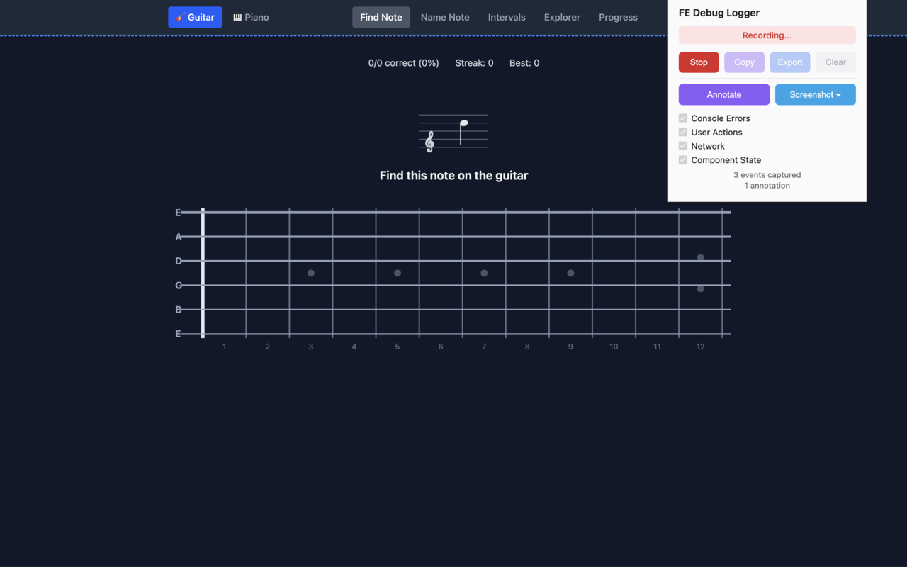
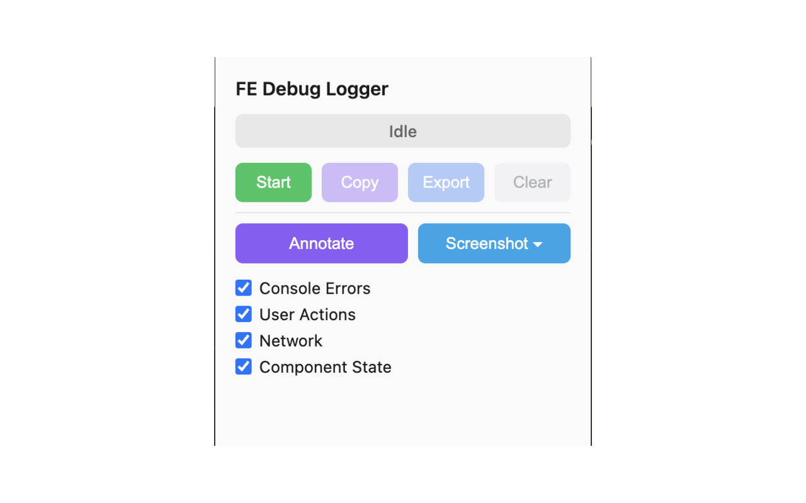
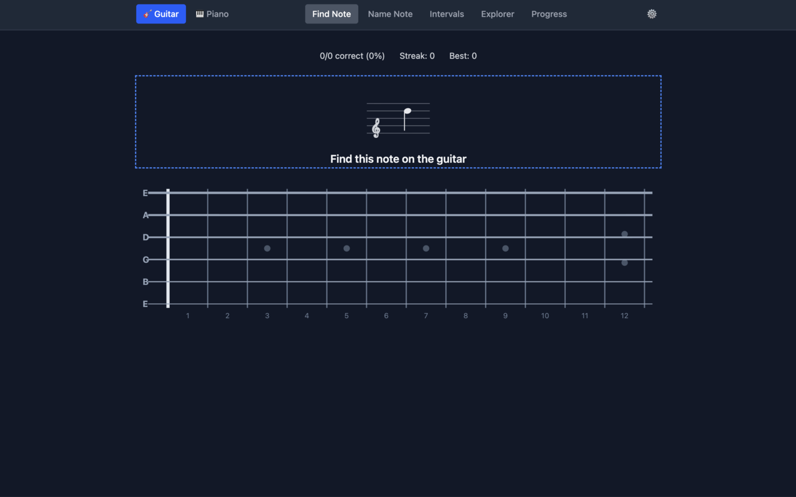

# FE Debug Logger

Chrome extension that captures frontend debug logs as structured Markdown — optimized for AI-assisted debugging with Claude Code.

| Recording & Annotation | Popup UI | Exported Output |
|---|---|---|
|  |  |  |

## Features

- **Console Capture** — hooks `console.error`, `console.warn`, `window.onerror`, unhandled promise rejections
- **User Action Tracking** — records clicks, form inputs, navigation with DOM selectors
- **Network Monitoring** — logs HTTP errors (status >= 400) and slow requests (> 3s)
- **Component State Snapshots** — auto-detects React & Vue, captures props/state trees
- **DOM Annotation** — click elements to annotate with notes (`Option+Shift+A` on Mac / `Alt+Shift+A`)
- **Screenshot Capture** — visible page or a selected region, each with an optional note
- **Selective Capture** — toggle categories independently
- **Sensitive Data Masking** — auto-masks password/token/apiKey fields
- **Structured Markdown Export** — session metadata, formatted tables, code blocks
- **Feedback Mode** — a floating button on the sites you enable: freeze the page, pick an element, write a bug or suggestion, review and export everything as one Markdown/ZIP (also shipped alone as the **FE Feedback** build)

## Install

Needs Chrome 111 or newer.

**From Chrome Web Store:** [FE Debug Logger](https://chromewebstore.google.com/detail/fe-debug-logger/gjmlfcmchkdnoocoalcomchocbncdlii) — updates itself, but can lag behind this repo while a new release is in review.

**From GitHub (latest version, Developer Mode):**

1. Get the code, either way:
   ```bash
   git clone https://github.com/minhtn012/fe-debug-logger.git
   ```
   or on GitHub click **Code → Download ZIP** and unzip it
2. Open `chrome://extensions/` in Chrome
3. Enable **Developer mode** (top right)
4. Click **Load unpacked** and select the folder (the one with `manifest.json`)
5. Pin the extension from the toolbar

**Update a GitHub install:** run `git pull` in the folder (or download the ZIP again into the same folder), then click the reload icon ↻ on the extension's card in `chrome://extensions/`. Captured data and feedback sessions stay. Do not also install the store version in the same Chrome profile.

**Builds:** `bash build.sh` packs two store uploads from the same source:

| Zip | What it is |
|-----|-----------|
| `fe-debug-logger-v<ver>.zip` | Full extension: popup, hotkey, Record, Annotate, Feedback |
| `fe-feedback-v<ver>.zip` | Feedback only: no popup, no hotkeys; clicking the toolbar icon turns feedback on/off for the current site |

To try the FE Feedback build unpacked, unzip `fe-feedback-v<ver>.zip` and load that folder. Install only one of the two builds per Chrome profile — both inject into every page, so having both gives two floating buttons and double console/network hooks.

---

## Usage: Record

Use the extension popup to capture debug data.

### Basic Workflow

1. Navigate to the page you want to debug
2. Click the extension icon to open the popup
3. Toggle capture categories as needed:
   - **Console Errors** — `console.error`, `console.warn`, unhandled exceptions
   - **User Actions** — clicks, form inputs, navigation, keyboard events
   - **Network** — HTTP errors (4xx/5xx), slow requests (> 3s)
   - **Component State** — React/Vue component props & state trees
4. Click **Start** to begin recording
5. Reproduce the issue on the page
6. Click **Stop** when done
7. Choose an output method:
   - **Copy** — copies Markdown to clipboard (paste directly into Claude Code)
   - **Export** — downloads `fe-debug-<site>-<time>.zip` with `debug-log.md` and a `screenshots/` folder
8. **Clear** — resets all captured data for a new session

### Annotation Mode

Annotate specific UI elements with notes to highlight problem areas:

1. Click **Annotate** in the popup (or press `Option+Shift+A` / `Alt+Shift+A`). Prefer the shortcut when the element is inside an open menu or dropdown: clicking the toolbar icon takes focus from the page and the menu closes, a shortcut does not
2. Hover over elements — they'll be highlighted with a blue outline
3. Click an element to select it
4. Enter a note describing the issue (e.g., "This button doesn't respond on mobile")
5. The annotation captures: element tag, CSS selector, dimensions, and your note
6. Press `Esc` or click **Annotate** again to exit annotation mode
7. Annotations appear in the exported Markdown with element context

If the shortcut does nothing, open `chrome://extensions/shortcuts`: Chrome leaves the key empty when Chrome itself or another extension already uses it. Assign any free key there.

### Screenshot Capture

Capture visual evidence alongside your debug logs:

1. Click the **Screenshot** dropdown in the popup
2. Choose a capture mode:
   - **Full Page** — captures the visible part of the page
   - **Select Region** — drag a rectangle to capture a specific area
3. After the capture a note box appears on the page: type what the screenshot shows and click **Save note** (or `Cmd/Ctrl+Enter`), or **Skip**
4. The export lists each screenshot with its note under **Screenshots**; the PNG files go in the ZIP's `screenshots/` folder (Copy keeps the notes, without images)
5. Maximum 5 screenshots per session to keep export size manageable

### Feed to Claude Code

After exporting, pass the debug log to Claude Code:

```bash
# Option 1: unzip the export and point Claude Code at it (screenshots included)
unzip fe-debug-localhost-2026-09-25T12-00-00.zip -d fe-debug
claude "Read fe-debug/debug-log.md and its screenshots, then fix the bug"

# Option 2: click Copy in the popup, then paste into Claude Code (text only, no images)
```

The exported Markdown gives Claude Code full context: what the user did, what errors occurred, what network requests failed, and what the component state looked like — no manual copy-pasting from DevTools needed.

---

## Usage: Feedback Mode

Collect UI feedback on a site without recording: each item is a screenshot of one element plus a note, with the console errors and failed/slow requests that happened meanwhile.

1. **Enable the site** — full build: open the popup and click **Feedback**; FE Feedback build: click the toolbar icon. A floating **Góp ý** button appears on every tab of that site (drag the `⋮⋮` grip to move it). Do the same again to turn it off.
2. **Start a session** — click **Góp ý**, type a session name, press Enter.
3. **Add items** — click **Chọn element**. The page freezes (animations, timers and hover menus stay as they are), so you can pick an element inside an open dropdown or tooltip. Choose **Bug** or **Góp ý**, write a note, save. `Esc` or **Dừng chọn** leaves the picker. Up to 50 items per session.
4. **Finish** — click **Xong**. The review page opens.
5. **Review** — edit notes, switch bug/suggestion, delete items, look at console errors and network issues, delete old sessions. Open it again at any time: right-click the toolbar icon → **Xem feedback đã lưu**, or **Xem feedback** in the popup (full build).
6. **Export** — **Copy MD**, **Export MD**, or **Export ZIP** (Markdown + one PNG per item). Paste the Markdown into Claude Code, or unzip and point it at `debug-log.md`.

Feedback data stays in `chrome.storage.local` until you delete the session on the review page. A site with a live feedback session cannot start a Record session, and the reverse.

### Limits of the page freeze

- Native `<select>` dropdowns are drawn by the OS: they cannot be captured or picked. Custom (HTML) selects work.
- Menus closed by a JS timer: the screenshot is still right (taken before the freeze), but elements inside the menu cannot be picked once it is gone.
- Cross-origin iframes: the freeze shield and hover lock cannot reach inside them.
- Capture-phase listeners the page registered on `window` before the extension loaded still run before the shield.
- `:hover` rules inside a web component's Shadow DOM are not copied by the hover lock.

---

## Export Format

The exported Markdown includes:

| Section | Content |
|---------|---------|
| Session Info | URL, timestamp, duration, browser, viewport |
| Report Metadata | Extension version, counts of annotations, screenshots, errors, network issues |
| Annotations | Note, severity, tags, selector, nearby events (±5s), element screenshot, DOM snapshot |
| Screenshots | Region and visible-page shots with their notes |
| User Actions | Click/input/navigation log with selectors |
| Console Errors | Error messages with stack traces |
| Network Issues | Failed requests, slow responses |
| Component State | React/Vue component tree snapshots |

Images are PNG files in the ZIP's `screenshots/` folder, linked from `debug-log.md`.

## Architecture

- **Manifest V3** — Chrome 111+ (MAIN-world content scripts, offscreen documents)
- **Vanilla JavaScript** — zero external dependencies (except bundled jszip)
- **Dual Content Script Pattern**:
  - ISOLATED world: Chrome API access, message bridge
  - MAIN world: Console/fetch/XHR hooks, framework detection
- **Offscreen Document** — Blob creation for MV3 file downloads
- **Chrome Storage API** — session state survives service worker restarts

## Privacy

- All data is stored **locally** on your machine (Chrome Storage API)
- **No analytics**, no tracking, no external data transmission
- Sensitive fields (password, token, secret, apiKey) are **automatically masked**
- Network capture skips `chrome-extension://` URLs

See [PRIVACY.md](PRIVACY.md) for full privacy policy.

## Contributing

Contributions are welcome! Please:

1. Fork the repository
2. Create a feature branch (`git checkout -b feat/your-feature`)
3. Commit changes (`git commit -m "feat: add your feature"`)
4. Push to the branch (`git push origin feat/your-feature`)
5. Open a Pull Request

**Code style:** Vanilla JavaScript, no build tools, no external dependencies. Follow existing patterns.

## License

[MIT](LICENSE)
